### Self-introduction

- 🌐 I'm currently working as a Web Frontend Developer and I'm aiming to a full stack. (I also like Prisma and mysql.)
- 🧳 I am currently using React and Next.js at work.
- 🗺 I live in Ansan-si, Korea.
- ⏳ I am 30 years old now. I started development at the 17.

### Favorite technique

- 🏷 Vercel based Next.js, Tailwind CSS, Styled JSX (SCSS)
- 📦 Railway.app based Nest.js, Swagger, React-Query
- 🍡 Supabase and Upstash based Prisma, MySQL, Redis
- 🍧 Figma based MUI, Rive, Blueprint.js, Figjam, Spline

### Hobby list

- 🧑🏻‍💻 I like to find and use a new library. (svelte might be)
- 😸 I have two cat (their colours are the same as 🐈🐈‍⬛)
- 🕹 I like games too. (e.g. overwatch, starcraft 2)
